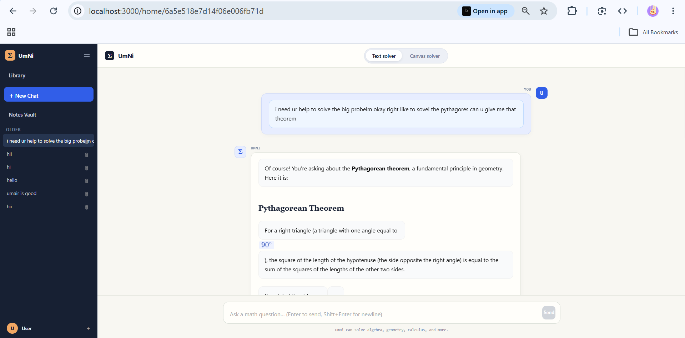
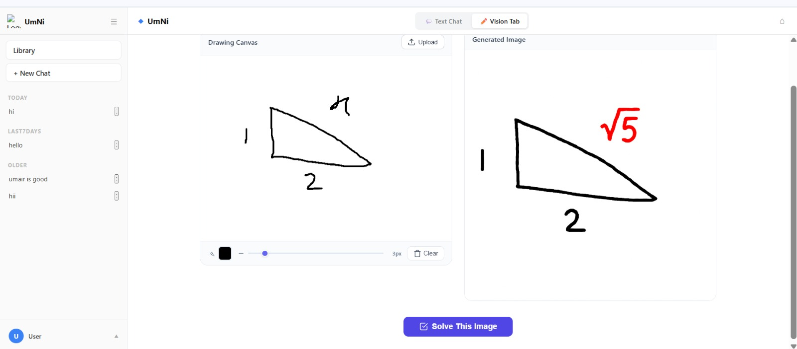
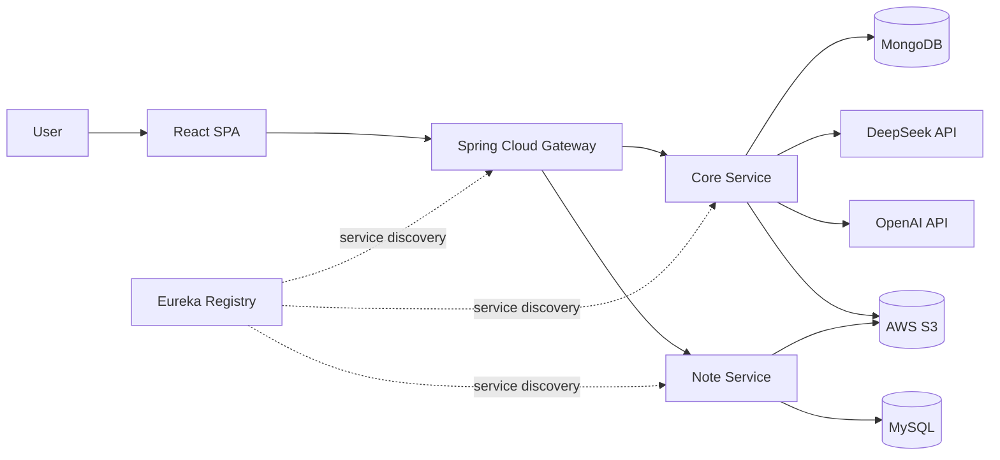

# UmNi - AI-Powered Multimodal Math Workspace

<div align=center>

**Solve mathematics through conversation, sketches, and study notes - in one secure workspace.**


</div>

UmNi is a full-stack learning platform that brings text-based AI assistance, visual problem solving, and personal study materials into a single application. It was built as a microservices project with a React client, Spring Boot services, service discovery, resilient gateway routing, and cloud-backed persistence.

## Product showcase

### AI chat

The conversational workspace keeps previous sessions in the sidebar and renders structured, step-by-step mathematical answers directly in the chat.



### Vision workspace

The Vision workspace lets a user draw a problem, send it to the AI, and receive a generated step-by-step solution while keeping both the original and solved images in their library.



## What makes UmNi useful

- **Ask naturally:** hold mathematical conversations with Markdown and KaTeX-rendered answers.
- **Solve visually:** draw a problem on a canvas and generate a worked solution image.
- **Keep context:** revisit chat sessions and saved vision results from a personal library.
- **Manage notes:** upload, download, and delete common study-file formats securely.
- **Control your data:** authenticated users can permanently delete their account after password confirmation.

## Architecture



| Service | Responsibility |
|---|---|
| `umni-frontend` | React UI for authentication, chat, vision, library, notes, and account settings |
| `api-gateway` | Central routing, CORS, load balancing, circuit breakers, and fallback responses |
| `umni-backend` | Authentication, AI chat, vision processing, persistence, and account lifecycle |
| `note-service` | Note metadata plus validated S3 upload, download, and deletion |
| `service-registry` | Eureka-based service registration and discovery |

## Core workflows

### Conversational math

1. The authenticated user opens or creates a chat session.
2. The Core Service stores the message and sends the conversation to DeepSeek.
3. The response is saved and rendered with Markdown and KaTeX in the client.

### Vision solving

1. The user draws a problem on the canvas.
2. The backend validates the PNG payload and sends it to OpenAI image editing.
3. Original and generated images are stored in S3, with ownership metadata in MongoDB.

### Study-note management

1. The user uploads a supported document through the Notes screen.
2. The Note Service checks size, extension, content type, and file signature.
3. The file is stored in S3 and its metadata is associated with that user in MySQL.

## Engineering highlights

| Area | Implementation |
|---|---|
| Security | JWT authentication, BCrypt passwords, protected routes, and per-user resource ownership |
| Input safety | Server-side validation for image and document size, type, and file signatures |
| Resilience | Gateway circuit breakers and explicit HTTP 503 fallbacks when services are unavailable |
| Data design | MongoDB for conversational and vision data; MySQL for structured note metadata |
| Cloud storage | Private S3 object storage for original images, generated solutions, and notes |
| Account lifecycle | Password-confirmed deletion across user-owned chats, messages, vision records, and stored files |
| Configuration | Secrets supplied through environment variables instead of committed source files |

## Technology stack

- **Frontend:** React 18, React Router, Axios, Bootstrap, KaTeX, React Markdown, HTML Canvas
- **Backend:** Java 17, Spring Boot, Spring Security, Spring Cloud Gateway, Eureka, Resilience4j
- **Data and storage:** MongoDB Atlas, MySQL, AWS S3
- **AI integrations:** DeepSeek for chat and OpenAI for vision output

## API overview

All client traffic enters through the API Gateway at `http://localhost:8080`.

| Route group | Purpose |
|---|---|
| `/api/auth/**` | Registration, login, profile, and account deletion |
| `/api/chat/**` | Chat sessions and messages |
| `/api/vision/**` | Vision solving and saved-image library |
| `/api/notes/**` | Note upload, listing, download, and deletion |

## Repository structure

```text
cdac-project/
|-- umni-frontend/       React single-page application
|-- api-gateway/         Spring Cloud Gateway
|-- service-registry/    Eureka discovery server
|-- umni-backend/        Core authentication, chat, and vision service
|-- note-service/        Notes and file-storage service
|-- docs/images/         README product screenshots
`-- .env.example         Backend configuration template
```

## Run locally

### Prerequisites

- Java 17 and Maven
- Node.js and npm
- MongoDB and MySQL access
- AWS S3 bucket credentials
- DeepSeek and OpenAI API keys

### Configuration

For Docker Compose, copy the root environment template and replace every placeholder:

```powershell
Copy-Item .env.example .env
```

Docker Compose reads this root `.env` file automatically. Direct Maven startup does not. When running the Spring services directly, export the same variables in the terminal or provide them through the ignored `application-local.properties` files used by Core Service and Note Service.

For the React client:

```powershell
Copy-Item umni-frontend/.env.example umni-frontend/.env
```

Do not commit populated `.env` files or cloud/API credentials.

### Start the services

Start the applications in this order:

1. `service-registry` - port `8761`
2. `umni-backend` - port `8082`
3. `note-service` - port `8083`
4. `api-gateway` - port `8080`
5. `umni-frontend` - port `3000`

For each Spring module, run:

```powershell
mvn spring-boot:run
```

Then start the frontend:

```powershell
cd umni-frontend
npm install
npm start
```

Open `http://localhost:3000` in a browser. The Eureka dashboard is available at `http://localhost:8761`.

## Testing and quality assurance

UmNi includes automated checks across the frontend and supporting microservices. The current suite focuses on application startup, a critical file-upload security boundary, and the public React entry point.

| Test area | Module | What it verifies |
|---|---|---|
| Application context | `service-registry` | Eureka server configuration and Spring context load successfully |
| Application context | `api-gateway` | Gateway routes, filters, discovery, and Spring configuration can initialize |
| Application context | `note-service` | JPA, security, storage, and service configuration can initialize with test properties |
| File validation | `note-service` | Valid PNG content is accepted and normalized to the correct media type |
| File validation | `note-service` | A file with a spoofed PDF extension but invalid content is rejected |
| UI smoke test | `umni-frontend` | The public UmNi landing page renders its primary heading |
| Production build | `umni-frontend` | React assets compile and bundle successfully for production |

Run the backend test suites from the repository root:

```powershell
mvn -f service-registry/pom.xml test
mvn -f api-gateway/pom.xml test
mvn -f note-service/pom.xml test
```

Run the frontend smoke test and production build:

```powershell
cd umni-frontend
npm test -- --watchAll=false
npm run build
```

### Current coverage boundaries

The automated suite does not yet cover end-to-end authentication, chat and vision persistence, gateway-to-service integration, or live DeepSeek, OpenAI, S3, MongoDB, and MySQL interactions. Those workflows are currently verified manually during local multi-service runs. Integration tests with mocked external providers and CI execution are planned next.

## Deployment roadmap

The repository is prepared for deployment on a single **AWS EC2** instance with multi-stage Docker images and Docker Compose. The React production build is served through Nginx, which forwards API requests to the Spring Cloud Gateway. The Gateway remains the single entry point for the Core and Note microservices registered through Eureka.

~~~text
Browser
   |
 HTTPS
   v
AWS EC2 / Nginx
   |-- React production build
   +-- /api -> API Gateway -> Core Service / Note Service
                              |
                              +-- Eureka service discovery
~~~

Only host port 80 is published. Eureka, Gateway, Core Service, and Note Service remain private inside one Docker bridge network. Runtime credentials are supplied through the ignored root .env file, and container health checks control startup order.

See [DEPLOYMENT.md](DEPLOYMENT.md) for the complete EC2 setup, security-group rules, environment configuration, deployment command, and troubleshooting steps.

## Current scope

UmNi is a portfolio/capstone application demonstrating an end-to-end microservices system and real external AI integrations. Local development and the single-instance EC2 deployment package are ready; a public live URL will be added after the first EC2 release. The next engineering priorities are automated integration tests, CI/CD, HTTPS, and observability.

---

<div align=center>
Built to explore how conversational and visual AI can make mathematical problem-solving more interactive.
</div>
